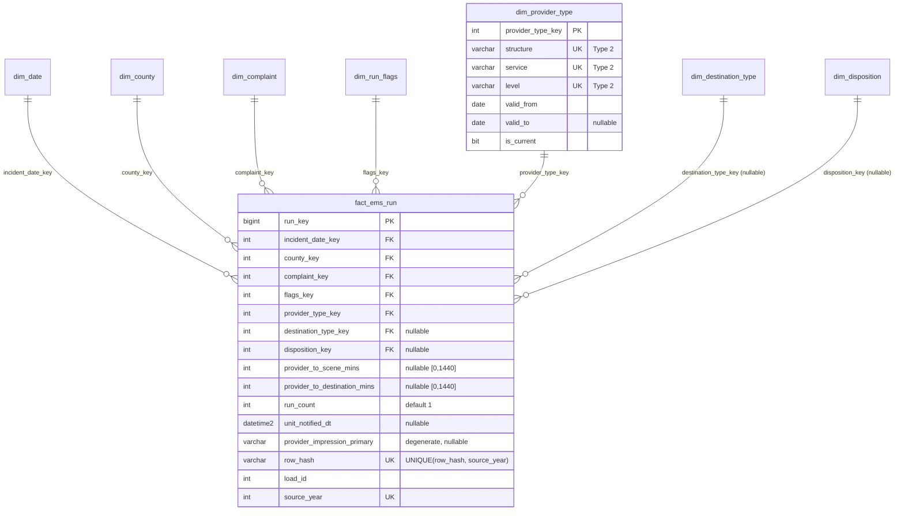

# NEMSIS Indiana EMS — ETL and Dimensional Warehouse

End-to-end ETL that ingests NEMSIS-compliant Indiana EMS run data (CSV, 2014–2025, ~10.5M rows
across 12 annual files), stages it raw, validates and quarantines bad rows, and loads it into a Kimball
dimensional warehouse on SQL Server.

- **Source:** Indiana EMS runs (`hub.mph.in.gov`), NEMSIS v3.5 element families.
- **Target:** SQL Server (T-SQL), schemas `stg` (staging) and `dw` (warehouse).
- **Language:** Python (pandas + pyodbc), config-driven via [`config/params.yaml`](config/params.yaml).

---

## Architecture

```
ems_runs_<year>.csv
   │  extract.py     chunked read, header trim, 22-col schema check
   ▼
DataFrame chunk ──► stage.py ──► stg.stg_ems_raw   (raw VARCHAR(MAX), partitioned by source_year)
   │  transform.py  validate, normalize county, repair timestamps/flags, compute row_hash
   ├──────────────► stg.stg_ems_quarantine   (rejected rows + reason code)
   ▼  (clean rows)
   load.py
   ├─ 1. dimensions ──► dw.dim_*          (Type 1 overwrite, Type 2 versioned)
   └─ 2. fact       ──► dw.fact_ems_run   (surrogate FKs + measures + timestamps + audit)
```

`pipeline.py` is the sole entry point. It assigns one `load_id` per run and streams each source
year through extract → stage → transform → load, dimensions before the fact.

### Star schema (ERD)

Full annotated diagram in [`docs/schema-diagram.md`](docs/schema-diagram.md); DDL in [`sql/`](sql).



### Repository layout

| Path | Contents |
|------|----------|
| [`src/`](src) | ETL modules: `extract`, `stage`, `transform`, `load`, `pipeline`, `utils` |
| [`sql/`](sql) | T-SQL DDL, run in numeric order (`01`→`04`) |
| [`config/`](config) | `params.yaml` (all configurable values) and `indiana_counties.txt` (canonical county reference) |
| [`docs/`](docs) | `schema-diagram.md` (ERD) |
| [`data_quality/`](data_quality) | `raw_ems_dq.md` (profiling observations), `dq_complex_checks.py` |
| `requirements.txt` | Python dependencies |

---

## How to run

### 1. Python environment

```bash
python -m venv .venv
# Windows (PowerShell):  .venv\Scripts\Activate.ps1
# POSIX:                 source .venv/bin/activate
pip install -r requirements.txt   # pandas, pyyaml, pyodbc
```

### 2. Provision the warehouse

Run the DDL against your SQL Server database **in order** (creates the `stg` and `dw` schemas,
partition function/scheme, dimensions, fact, and quarantine table):

```bash
sqlcmd -S <server> -d <database> -i sql/01_stg_ems_raw.sql
sqlcmd -S <server> -d <database> -i sql/02_dw_dimensions.sql
sqlcmd -S <server> -d <database> -i sql/03_dw_fact.sql
sqlcmd -S <server> -d <database> -i sql/04_stg_ems_quarantine.sql
```

### 3. Configure

Edit [`config/params.yaml`](config/params.yaml): database `server`/`database`/`driver`/`auth`,
`paths.source_dir` (where the `ems_runs_<year>.csv` files live), `batch_size`, `read_chunk_size`,
`load_mode`, and `env` (dev/test/prod). No paths, connection strings, batch sizes, or environment
names are hardcoded in the source.

### 4. Run the pipeline

```bash
python src/pipeline.py --config ./config/params.yaml
```

The run logs to the console and to `logs/etl_load_<load_id>.log`.

---

## Grain

**One fact row = one EMS run** (one dispatched-unit incident record) as delivered in the source CSV.

The source carries no incident, patient, unit, or record identifier, so there is no key to support
a finer grain (per-patient or per-disposition) or to roll rows up to an incident. Each row already
describes one unit encounter, which is the transaction grain. Because there is no natural key, row
identity is the MD5 hash of all 22 source columns, scoped per file by `source_year`
(`UNIQUE(row_hash, source_year)`). SCD types and rationale are summarized in the dimension table and
notes below.

### Dimensions

| Dimension | Source column(s) | SCD | Role |
|-----------|------------------|-----|------|
| `dim_date` | `INCIDENT_DT` (date part) | Type 1 | Conformed |
| `dim_county` | `INCIDENT_COUNTY` | Type 1 | Conformed |
| `dim_run_flags` | `INJURY_FLG`, `NALOXONE_GIVEN_FLG`, `MEDICATION_GIVEN_OTHER_FLG` | Type 1 (junk) | Fact-local |
| `dim_complaint` | `CHIEF_COMPLAINT_DISPATCH`, `CHIEF_COMPLAINT_ANATOMIC_LOC`, `PRIMARY_SYMPTOM` | Type 2 | Fact-local |
| `dim_provider_type` | `PROVIDER_TYPE_STRUCTURE` / `_SERVICE` / `_SERVICE_LEVEL` | Type 2 | Conformed |
| `dim_destination_type` | `DESTINATION_TYPE` | Type 2 | Conformed |
| `dim_disposition` | `DISPOSITION_ED`, `DISPOSITION_HOSPITAL` | Type 2 | Conformed |

Type 2 was chosen for the code-list dimensions because NEMSIS code semantics demonstrably drift
across the 12-year span (for example `DESTINATION_TYPE` grew from 10 to 28 distinct values), and
preserving point-in-time codes keeps historical runs interpretable. `PROVIDER_IMPRESSION_PRIMARY`
is kept as a degenerate text column on the fact rather than a dimension: its cardinality exploded
from 91 to 1,831 values as the field shifted from a coded pick-list to free text, making it
unreliable as a versioned dimension.

---

## Data quality rules

Raw profiling observations: [`data_quality/raw_ems_dq.md`](data_quality/raw_ems_dq.md).

A row is **rejected to `stg.stg_ems_quarantine`** (first failing check wins) when:

| Reason code | Condition |
|-------------|-----------|
| `INCIDENT_DT_INVALID` | `INCIDENT_DT` null or unparseable |
| `INCIDENT_DT_OUT_OF_RANGE` | before 2013-01-01, or dated in a year later than the load year |
| `INCIDENT_COUNTY_INVALID` | not in the canonical 92-county list after normalization |
| `DURATION_MINS_OUT_OF_RANGE` | a duration is non-numeric, negative, or > 1440 |
| `FLAG_INVALID` | `NALOXONE_GIVEN_FLG` or `MEDICATION_GIVEN_OTHER_FLG` not in {0,1} |
| `PROVIDER_TYPE_NULL` | `PROVIDER_TYPE_STRUCTURE` or `PROVIDER_TYPE_SERVICE` is null |

**Field-level repairs** keep the row (logged, not quarantined):

- County names normalized (uppercase, trim, strip periods) so `ST JOSEPH` / `ST. JOSEPH` resolve to
  one county before lookup.
- Unit/patient timestamps outside `[INCIDENT_DT − 1 day, INCIDENT_DT + 7 days]` set to NULL.
- `INJURY_FLG` mapped case-insensitively to {Yes, No, Unknown}; anything else becomes `Unknown`.
- Durations rounded to whole minutes (the fact column is INT).

Timestamp-ordering validation is computed for **2014–2021 only**; 2022+ timestamps are
midnight-truncated, so ordering "violations" there are truncation artifacts, not errors.

---

## Incremental strategy

- **Mode** is set by `etl.load_mode`: `full` (all configured years) or `incremental`
  (`etl.load_window_years`, e.g. `[2024, 2025]`).
- **`load_id`** is assigned per run as `MAX(load_id)+1` from `stg.stg_ems_raw` (1 if empty) and
  threaded through every module for lineage.
- **Idempotency:** the fact enforces `UNIQUE(row_hash, source_year)`. A re-run pre-filters rows whose
  `(row_hash, source_year)` already exist and de-dups within the batch, so duplicates are silently
  skipped and counted rather than aborting the run. Type 2 dimensions insert a version only when the
  natural key has no current row.
- **Large-data patterns:** CSVs are read in chunks (`read_chunk_size`); inserts are batched
  (`batch_size`) with no row-by-row execution; `stg_ems_raw` is partitioned by `source_year` for
  per-year load/reload; the fact is clustered on `(incident_date_key, county_key)` for the common
  analytic access path.

---

## Logging

Each run writes to console and to `logs/etl_load_<load_id>.log`. Per year it records step status and
the full count set: `extracted`, `staged`, `rejected`, `quarantined`, `fact_inserted`,
`fact_skipped` (idempotent duplicates), plus field-repair counts (`injury_repairs`, `ts_repairs`),
`ordering_violations` (2014–2021), and the reject reason breakdown. A `START` and `DONE` line bound
the run with cumulative totals. A failure in one year is logged with `status=FAILED` and the error;
the run continues to the next year.

---

## Assumptions

- **No natural key** in the source forces the run grain and a hash-based row identity; exact-duplicate
  rows cannot be distinguished from legitimate repeat encounters and are collapsed by identical hash.
- **Canonical county list** (`config/indiana_counties.txt`) is the 92 Indiana counties, materialized
  from the validated distinct source values; the source contained exactly these 92 after
  normalization.
- **`DISPOSITION_ED` / `DISPOSITION_HOSPITAL`** are 97–99% null but retained for completeness; treat
  as mostly missing downstream.
- **Duration fields are loaded as-is** (range-validated, rounded to int); they are not derived from or
  reconciled against timestamps, because profiling showed the stored values do not match any
  timestamp-derived formula.
- **Type 2 `valid_from`** uses the source row's `INCIDENT_DT`; for a tuple seen across many rows it is
  the earliest date within the chunk that first introduces it.
- **Database not executed in this environment:** no SQL Server instance was available, so the DDL and
  the load-side logic are verified by spec conformance and DB-free tests, not a live load. End-to-end
  execution against a provisioned SQL Server is the one remaining validation step.
